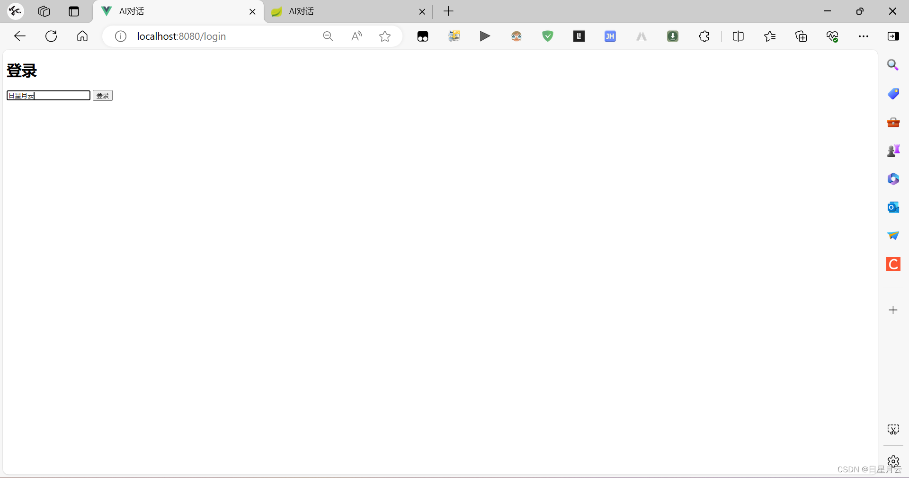
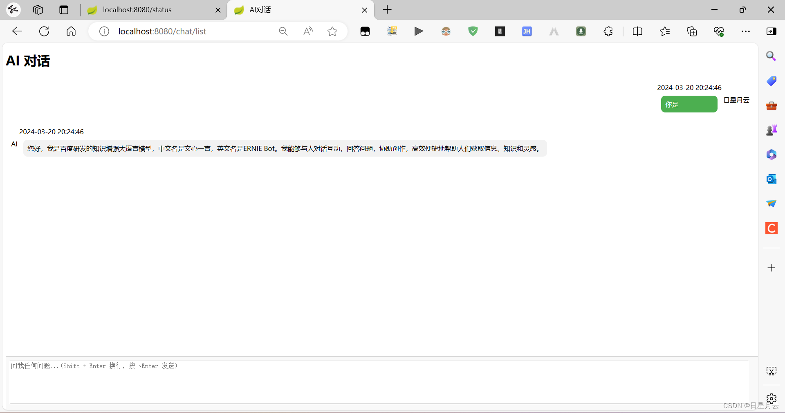

# 开发一个AI对话聊天

## 前言

使用百度千帆平台的大模型，完成一个简单的AI对话聊天

## 登录

LoginController

使用Session存储username

## AI对话

CharController

调用util.QianfanUtil来进行对话

然后在数据库中进行查询和存储

# 效果演示

## 登录

输入用户名，点击登录
返回“登录成功”

查询状态

## AI对话

页面

输入内容，点击回车即可提问

## 后言

待完善的功能:

1. 用户对话之后，需要等待回复，才能弹出对话内容

2. 等待期间，还能输入聊天框

3. 并且，没有终止生成

4. 没有左边框-新建对话

5. 没有md格式的复制

